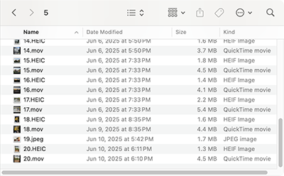
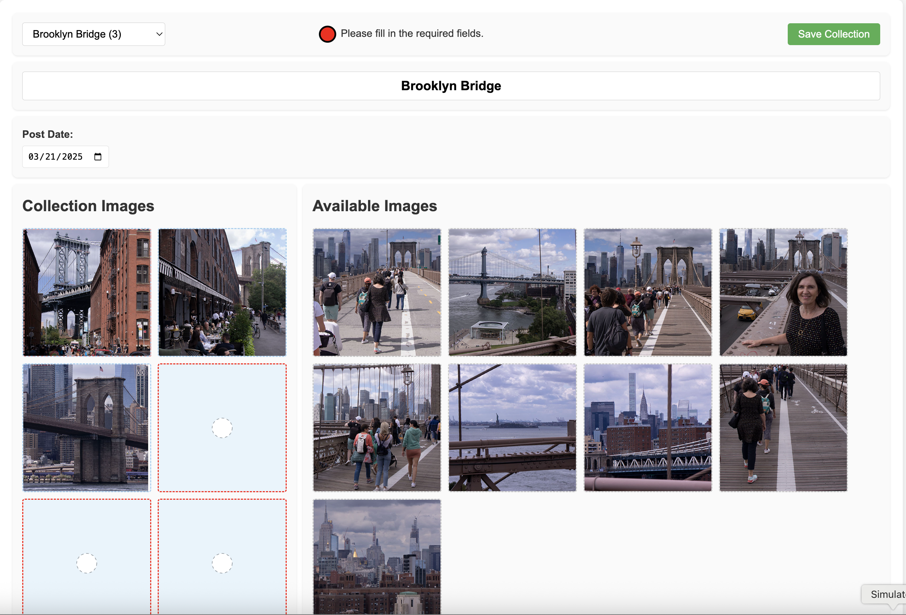

# Collection Maker

How to create a new collection for the Collections project.

* create a `tmp/cN` folder and add images
* rename, convert, and make thumbnails
* run the maker command to write `cN.json`
* move the folder to `dist/images` and build
* edit descriptions on the image page (admin) and set order on the maker page
* deploy, set zoom points, then publish

[⬇](#Contents) (table of contents at the bottom)

# Create Folder

Create a tmp folder named with the collection prefix. List
`dist/images` to find the next number. For collection 24:

~~~
mkdir tmp/c24
~~~

Put 8, 10, 12 or 16 of your best photos in the folder. Export unmodified
originals from Apple Photos, or copy files from Adobe Bridge.

__Mac Photos__

* create an album with all the photos for the topic
* mark 8 to 20 favorites
* filter by favorites, select all
* File > Export > Export Unmodified Originals
* uncheck "Export IPTC as XMP"
* filename: Sequential, no prefix, no subfolder
* export into the empty `tmp/c24` folder

Live Photos export as paired `.HEIC` and `.mov` files.

__Standard Rename__

Rename camera JPEGs or HEIC/mov pairs to the standard collection
names. JPEG extensions become `.jpg`. Files that already use the
standard name are left alone. New files take the next number after the
highest number in the folder. Gaps are kept.

~~~
# from container
scripts/standard-rename tmp/c24
~~~

Examples:

~~~
DSCN1888.JPG  ->  c24-1-p.jpg
DSCN1889.JPEG ->  c24-2-p.jpg

1.HEIC  1.mov  ->  c24-1-p.HEIC  c24-1-v.mov
2.HEIC  2.mov  ->  c24-2-p.HEIC  c24-2-v.mov
~~~

Delete any `.mov` files you do not want to keep.

__Convert HEIC and MOV__

Convert remaining HEIC stills to jpg. The basename stays the same:

~~~
scripts/convert-heic-previews tmp/c24

convert: c24-1-p.HEIC -> c24-1-p.jpg
~~~

If you only have a video, make a jpg preview by extracting a frame
with the free Frame Grabber application.

Convert remaining `.mov` files to `.mp4`. The basename stays the same.
Browsers play mp4 more reliably. The conversion keeps the Live Photo
soundtrack.

~~~
scripts/convert-live-videos tmp/c24

convert: c24-1-v.mov -> c24-1-v.mp4
~~~

Live videos are optional. The maker pairs each video with the preview
that shares a stem: `c24-10-v.mp4` goes with `c24-10-p.jpg`. Live
Photos play on press-and-hold. Longer clips show a play button
instead of the LIVE badge.

You can also convert HEIC in Photoshop:

* Open the HEIC files in Photoshop
* edit then flatten if necessary
* save each file as jpg (File > Save) -- uncheck "Embed Color
  Profile: Display P3"
* Jpg options: Quality 8, Baseline, no preview

| File     | Role     |
| -------- | -------- |
| -p.jpg | The still photo shown on the image page, used for dimensions in cjson, zoom/pan, and offline download |
| -v.mp4 | Optional motion clip. Live Photos play on press-and-hold. Longer videos show a play button, play to the end, then stop |
| -t.jpg | Square thumbnail for the index and thumbnail pages |

♫ Notes:

-- Some types of editing in Photoshop will create layers. You can tell
when this happens when saving by the .psd extention. In this case
flatten the image (layer > flatten image), then save.

-- If you save the jpgs with "Embed Color Profile..." checked, the
maker command will report the file as MPO format instead of JPEG. MPO
files are not supported.

__Thumbnails__

Copy each preview to a thumbnail file:

~~~
# from the collections folder
folder=c24 # variable
for file in tmp/$folder/*-p.jpg; do
  cp "$file" "${file/-p.jpg/-t.jpg}"
done
~~~

Open the `-t` files in Photoshop and crop them square 480 x 480.

* use the crop tool
* use the Image Size dialog (option+command i)
* save
* close

The folder should contain matching `-p.jpg` and `-t.jpg` files, optional
`-v.mp4` files, and nothing extra. Previews must be at least 933
pixels on both sides.

Duplicate the tmp folder in the Finder if you want a backup.

[⬇](#Contents)

# Run Maker

Run the maker command to validate the files and write `cN.json`. It
leaves the folder in place.

~~~
# from container
scripts/maker tmp/c24

Wrote tmp/c24/c24.json
~~~

The json has empty titles and descriptions and the order isn't set.
You fill those in later on the maker web page. Collections start in
building state, so only admins see them.

Add GPS locations and capture times:

~~~
scripts/add-locations tmp/c24/c24.json
~~~

Move the folder into dist, then build:

~~~
mv tmp/c24 dist/images/
g all
~~~

[⬇](#Contents)

# Edit Collection

Write image descriptions on the image page while logged in as admin.
Tap a description; a cursor appears so you can edit it. On localhost
the change is saved when you tap away. On an iPhone, tap the download
icon after editing, then air-drop the file if needed.

Use the maker page to set the photo order.

Build first:

~~~
g all
~~~

Open the Maker Page as an admin from the index about box. Select the
collection from the dropdown. Before you name it, the list shows the
collection number, like: "title (24)".

Use the local site:

~~~
http://localhost:8000/
~~~

♫ Note: after building a new maker page, do a hard refresh
(shift-cmd-R) so the photos appear in the correct location.

__Saving Changes__

Edits update the in-memory `cjson`. Save with the **Save** button.
Refreshing or switching collections without saving discards changes.

Save writes `dist/images/cN/cN.json` through the localhost admin API
on port 3001. Then run `g all` and test on Chrome at localhost.

__Maker Page UI__

Below is a partial screenshot of the maker web page:

The maker page includes the following elements:

* __Left Panel__: A 2-column by 8-row table showing the collection images and their order.
* __Right Panel__: A table of 20 available images.
* __Top Section__: Fields for entering the collection’s title and post date.
* __Bottom Section__: Fields for entering descriptive text for the collection and its images.

__Interactions__

* Click an image in the right panel to add it to the next available collection box.
* Click an image in the left panel to move it back to the available images.
* Cmd-click a collection box to open or close an empty box.

[⬇](#Contents)

# Zoom Points

After the descriptions and order look good, deploy and set zoom
points.

~~~
g all
scripts/deploy -s
~~~

On an iPhone, on the image page, size and pan each image. Click the
download icon and air-drop the `cjson` to your desktop, then move it
to `dist/images/cN/cN.json`.

On localhost the download icon writes that file directly.

♫ Note: air-drop doesn't work when your iphone is plugged into your
mac.

Run `g all`, deploy, and check the image pages again.

__Zoom Point Guide__

When setting zoom points for an image, the goal is to make each
picture look like it was created for the screen it’s displayed
on, whether in portrait or landscape orientation. A good zoom point
creates a natural, visually pleasing crop without drawing attention to
the fact that the image has been zoomed.

A well-chosen zoom point can reduce excessive zooming.  The user
doesn’t feel the need to see what’s missing.

* Aim for a good full screen fit in both portrait and landscape modes.
* You are free to zoom in a little aggressively since double tap
  toggles between the zoom point and fit-to-screen.
* Avoid forced crops – If it feels cramped or awkward, zoom out, it’s
  often better to zoom all the way out and show the full frame.
* Show background – Leave hints of background when it helps tell the
  bounds.

[⬇](#Contents)

# Remove DS Store Files

The Mac finder creates a .DS_Store file in a folder when it contains
an image. Remove these files from the distribution files and from S3.

Delete the DS Store files from the distribution files:

~~~
find dist -name .DS_Store -delete
~~~

List DS Store files in the s3 bucket sflennikco:

~~~
aws s3 ls sflennikco --recursive | grep .DS_Store

2025-08-06 03:21:04       6148 .DS_Store
2025-09-27 22:11:59       6148 images/.DS_Store
2025-06-22 21:44:23       6148 images/c4/.DS_Store
2025-08-08 04:07:08       8196 images/c5/.DS_Store
2025-09-01 17:50:38       6148 images/c7/.DS_Store
2025-09-19 21:55:03       6148 images/c8/.DS_Store
~~~

Delete one DS_Store file:

~~~
aws s3 rm s3://sflennikco/images/c4/.DS_Store
~~~

[⬇](#Contents)

# Deploy

The deploy command copies the files to S3 and updates Cloudfront. The
collections in "building" state are only visible to admins.  This
allows admins to set zoom points and test the collection.

Once the collection looks good, you remove the "building" field from
the cjson, build all, then deploy again.  This publishes it to the
world.

 ~~"building": true,~~

~~~
g all
scripts/deploy -s
~~~

Test by logging out of admin and logging back in as a regular user.
On the iPhone, confirm the new collection appears in the index.

[⬇](#Contents)

# Notifiy

Get your cognito user id then send a notification to yourself to test.

~~~
scripts/cognito -l
scripts/notification --publish xxxx "Manzantia 2026"
~~~

Send a notification to all users.

~~~
scripts/notification --publish all "Manzantia 2026"
~~~

[⬇](#Contents)

# Replace Image

Steps to replacement an image with a new one:

* create new preview and thumbnail images
* copy the two images into the images folder replacing the originals
* test collections in Chrome on your desktop, refresh the page
* deploy the files to s3
* on the iphone delete the collection
* on the iphone download the collection

[⬇](#Contents)

# Contents

* [Create Folder](#create-folder) -- how to collect, rename, convert, and thumbnail images.
* [Run Maker](#run-maker) -- how to write cN.json and move the folder to dist.
* [Edit Collection](#edit-collection) -- how to edit descriptions on the image page and set order.
* [Zoom Points](#zoom-points) -- how to set the collection zoom points.
* [Remove DS Store Files](#remove-ds-store-files) -- remove the .DS_Store files.
* [Deploy](#deploy) -- how to publish the collection to the world.
* [Notify](#notify) -- how to notify users of the new collection.
* [Replace Image](#replace-image) -- how to replace an image.
