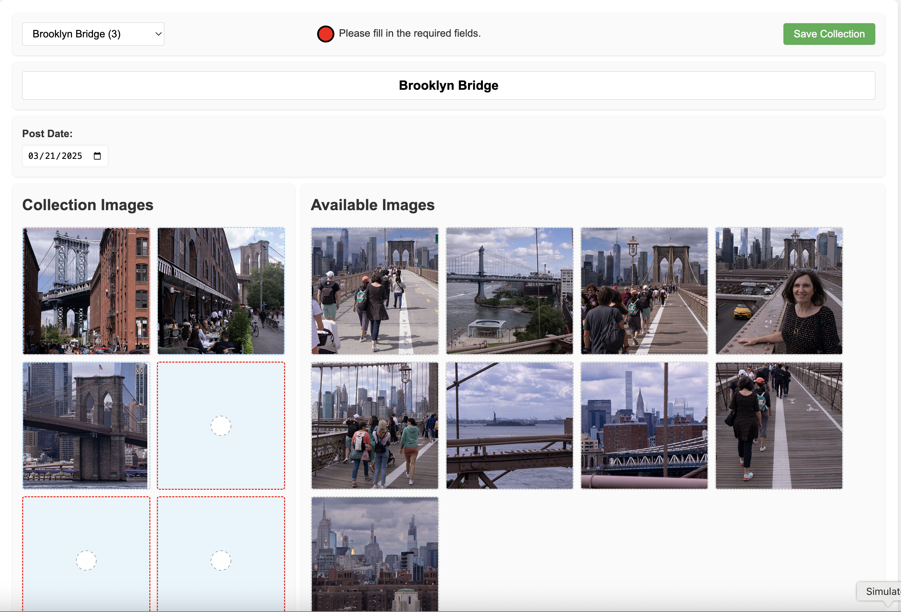

# Collection Maker

How to create a new collection for the Collections project.

* create a folder with images
* run the maker command
* edit the collection with the maker web page
* define zoom points for the images
* deploy

[⬇](#Contents) (table of contents at the bottom)

# Create Folder

Create a tmp folder with images and their thumbnails. Make sure the
folder contains:

* start with 8 to 20 of your best photos. Pick ones with a story you can write about.
* each image has a thumbnail
* all images are jpg
* preview files end with -p.jpg
* thumbnail files end with -t.jpg
* preview files are at least 933 pixels wide and tall
* thumbnail files are square 480 x 480 pixels
* no extra files exist in the folder

Create the folder in the tmp folder named with the collection
number. You can determine the next collection number by listing the
images folder. In the example 9 is the next number:

~~~
cd ~/code/collections
ls dist/images

c1 c2 c3 c4 c5 c6 c7 c8
~~~

Create the folder, For example, for the 9th collection:

~~~
mkdir tmp/9
~~~

__Mac Photos__

Here are the steps you can use to collect the files with the Mac
Photos app.

* launch Photos App
* create an album with all the photos, good and bad, for the topic
* mark 8 to 20 favorite images by clicking the heart icon
* filter by favorites so just the favorites show
* select all
* select export menu: File > Export > Export Unmodified Originals for 20 Photos
* uncheck "Export IPTC as XMP"
* select filename: Sequential
* leave the prefix blank
* leave the Subfolder Format as None
* click Export
* select the empty tmp/9 folder

If your photos were Live Photos, you end up with .HEIC and .mov files
for each image.

* Remove the .mov files
* Open the HEIC files in Photoshop
* edit then flatten if necessary
* save each file as jpg (use File > Save) -- uncheck "Embed
  Color Profile: Display P3"
* Use Jpg options: Quality 8, Baseline, no preview
♫ Notes:

-- Some types of editing in Photoshop will create layers. You can tell
when this happens when saving by the .psd extention. In this case
flatten the image (layer > flatten image), then save.

-- If you save the jpgs with color information the maker command will
report the file as MPO format instead of JPEG.

-- How do you pick a live photo frame to edit?  What is a HEIC
file, one image or multiple. What is the .mov file?

-- If you drag and drop photos from Photos to the tmp folder, you
get jpg files. How does Photos app make the jpg from the originals?
How does this workflow compare to the one documented here?

* once all the jpg are created, remove the HEIC files

Rename the jpg files (preview images) to end with "-p.jpg". Sometimes
you will get .jpeg files instead of .jpg files, the rename code
handles this case. For example:

~~~
cd tmp/9

for file in *.jpg; do
  mv "$file" "${file/.jpg/-p.jpg}"
done
for file in *.jpeg; do
  mv "$file" "${file/.jpeg/-p.jpg}"
done
for file in *.JPG; do
  mv "$file" "${file/.JPG/-p.jpg}"
done
~~~

You should have a folder that looks something like:

~~~
ls

1-p.jpg    2-p.jpg    4-p.jpg  6-p.jpg  8-p.jpg
10-p.jpg   3-p.jpg    5-p.jpg  7-p.jpg  9-p.jpg
~~~

Then copy all the images which will become the thumbnails:

~~~
cd tmp/9
for file in *-p.jpg; do
  cp "$file" "${file/-p.jpg/-t.jpg}"
done
~~~

You should have a folder that looks something like:

~~~
ls

1-p.jpg  10-p.jpg 2-p.jpg  3-p.jpg  4-p.jpg  5-p.jpg  6-p.jpg  7-p.jpg  8-p.jpg  9-p.jpg
1-t.jpg  10-t.jpg 2-t.jpg  3-t.jpg  4-t.jpg  5-t.jpg  6-t.jpg  7-t.jpg  8-t.jpg  9-t.jpg
~~~

Open the thumbnails (`-t`) images in Photoshop and crop them square
480 x 480 dimensions.

* use the crop tool
* use the Image Size dialog
* save
* close

You should have a files that looks something like the following. Notice
the sizes of the p verses the t files:

~~~
ls -s

 5448 1-p.jpg   7408 2-p.jpg   3680 4-p.jpg   3576 6-p.jpg  10832 8-p.jpg
  200 1-t.jpg    224 2-t.jpg    256 4-t.jpg    200 6-t.jpg    264 8-t.jpg
 4240 10-p.jpg  3704 3-p.jpg   3368 5-p.jpg   4192 7-p.jpg   9136 9-p.jpg
  216 10-t.jpg   224 3-t.jpg    256 5-t.jpg    248 7-t.jpg    256 9-t.jpg
~~~

Duplicate the tmp folder in the Finder. Right click the tmp/9 folder
and select "duplicate".  You will get a "tmp/9 copy" folder.

[⬇](#Contents)

# Run Maker

Run the maker command to create the `cjson` file and to move the
collection's tmp folder to the dist folder.

The `cjson` file contains empty titles, descriptions, and an arbitrary
image order. You will update this information later using the maker
web page.

The maker command validates the files and if a problem is found, the
process stops so you can correct it. The command:

* validates the files
* creates the `cjson` file in the folder
* moves the new folder to the `images` directory
* sets the `cjson` order list to `-1`, indicating no images are in the collection yet

For example:

~~~
# from container
scripts/maker -n 9

Created a collection folder and moved it to: dist/images/c9
~~~

[⬇](#Contents)

# Edit Collection

Use the maker page to determine the photo order, to add descriptive
text, etc.

You build the maker page with gulp, for example:

~~~
g all
~~~

You access the Maker Page as an admin from the index's about box by
clicking the maker link.  Select the collection to edit from the
dropdown menu. Before you name the collection, the select list will
show the collection number only, like: "(9)". Once the page is loaded
in your browser you can continue to use it without having to go back
to the index page.

You see the local host index page with the url:

~~~
http://localhost:8000/
~~~

Perform all testing on `localhost` before publishing the collection.

♫ Note: after building a new maker page, do a hard refresh on the page
(shift-cmd-R) so the photos appear in their correct location on the
page.

__Saving Changes__

Edits to the maker page update the `cjson` in memory version. Save
your changes using the **Save** button to avoid losing
them. Refreshing the page or selecting a different collection without
saving will __discard your changes__.

When you save, the `cjson` file it is downloaded to your `Downloads`
folder. Move it to the `images` directory. For example:

~~~
mv ~/Downloads/c9.json dist/images/c9/
~~~

Then repeat the rebuild and refresh steps in this section until the
descriptions, etc. are complete.

__Maker Page UI__

Below is a partial screenshot of the maker web page:

The maker page includes the following elements:

* __Left Panel__: A 2-column by 8-row table showing the collection images and their order.
* __Right Panel__: A table of 20 available images.
* __Top Section__: Fields for entering the collection’s title and post date.
* __Bottom Section__: Fields for entering descriptive text for the collection and its images.

__Interactions__

* Click an image in the right panel to add it to the next available collection box.
* Click an image in the left panel to move it back to the available images.
* Cmd-click a collection box to open or close an empty box.

[⬇](#Contents)

# Zoom Points

Build and deploy the code then set the zoom points.

After specifying the required elements and clicking the **Optimize**
button, the collection is marked as ready. Gulp builds ready
collections.

~~~
g all
scripts/deploy -s
~~~

On your iphone, on the image page, size and pan each image to define
its zoom points. Click the download icon then air-drop it to
yourself. This saves it in the downloads folder on your desktop
machine.  Then you move it to the collection's folder.

♫ Note: air-drop doesn't work when your iphone is plugged into your
mac.

Run the `g all` command to build in the final zoom points, then deploy
and test the image pages again.

__Zoom Point Guide__

When setting zoom points for an image, the goal is to make each
picture look like it was created for the screen it’s displayed
on, whether in portrait or landscape orientation. A good zoom point
creates a natural, visually pleasing crop without drawing attention to
the fact that the image has been zoomed.

A well-chosen zoom point can reduce excessive zooming.  The user
doesn’t feel the need to see what’s missing.

* Aim for a good full screen fit in both portrait and landscape modes.
* You are free to zoom in a little aggressively since double tap
  toggles between the zoom point and fit-to-screen.
* Avoid forced crops – If it feels cramped or awkward, zoom out, it’s
  often better to zoom all the way out and show the full frame.
* Show background – Leave hints of background when it helps tell the
  bounds.

[⬇](#Contents)

# Remove DS Store Files

The Mac finder creates a .DS_Store file in a folder when it contains
an image. Remove these files from the distribution files and from S3.

Delete the DS Store files from the distribution files:

~~~
find dist -name .DS_Store -delete
~~~

List DS Store files in the s3 bucket sflennikco:

~~~
aws s3 ls sflennikco --recursive | grep .DS_Store

2025-08-06 03:21:04       6148 .DS_Store
2025-09-27 22:11:59       6148 images/.DS_Store
2025-06-22 21:44:23       6148 images/c4/.DS_Store
2025-08-08 04:07:08       8196 images/c5/.DS_Store
2025-09-01 17:50:38       6148 images/c7/.DS_Store
2025-09-19 21:55:03       6148 images/c8/.DS_Store
~~~

Delete one DS_Store file:

~~~
aws s3 rm s3://sflennikco/images/c4/.DS_Store
~~~

[⬇](#Contents)

# Deploy

The deploy command copies the files to S3 and updates Cloudfront. The
collections in "building" state are only visible to admins.  This
allows admins to set zoom points and test the collection.

Once the collection looks good, you remove the "building" field from
the cjson, build all, then deploy again.  This publishes it to the
world.

 ~~"building": true,~~

~~~
g all
scripts/deploy -s
~~~

Test by logging out of admin and logging back in as a regular user.

[⬇](#Contents)

# Contents

* [Create Folder](#create-folder) -- create a folder with the collection images.
* [Run Maker](#run-maker) -- Run the maker command.
* [Edit Collection](#edit-collection) -- how to order and describe the new collection.
* [Zoom Points](#zoom-points) -- how to set the collection zoom points.
* [Remove DS Store Files](#remove-ds-store-files) -- remove the .DS_Store files.
* [Deploy](#deploy) -- how to publish the collection to the world.
