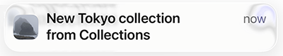
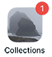

# Notification

When a new collection is published, users see a notification and a red
badge on the installed iPhone PWA icon. The notification looks similar to:

and the badge looks like:

The badge indicates that at least one new collection has been
published since the user last opened the app (the iphone requires a
number). It is not an unread-tracking system and does not track
collection views or downloads.

The collection list already shows unpublished content using the
existing download icon, so the badge only serves as an attention
indicator.

On an iPhone the user chooses whether to receive notifications using
the system notification settings:

~~~
settings > Notifications > Collections
~~~

[⬇](#Contents) Contents (table of contents at the bottom)

# Notification Flow

The notification system alerts users when new collections become available.

**Flow**:

* New collection is published.
* Backend code sends a Web Push notification.
* Application service worker code receives the push event.
* Service worker sets the icon application badge.
* User sees the badge on the home screen icon.
* User opens the application.
* Application immediately clears the badge.
* User sees the new collection with the existing download icon.

[⬇](#Contents) Contents

# Platform

The notification feature targets the primary Collections deployment
platform.

* iPhone
* Safari
* Home Screen installed PWA
* AWS backend

Besides the iPhone the code supports Chrome for testing but other
platforms are not currently a priority.

[⬇](#Contents) Contents

# Badge Behavior

The badge is set when a push notification is received and cleared when
the application becomes visible.

The badge persists while the application is closed and disappears as
soon as the user opens the application.

Collections manages user notification subscriptions by storing them in
AWS DynamoDB.

AWS notification services do not currently provide direct support for
browser Web Push subscriptions. Instead we use other AWS services to
implement it using:

* API Gateway
* Lambda
* DynamoDB
* Node.js web-push library

If you need to update node for web-push, follow the Update Node
document.

We expect the cost to store subscription in DynamoDB to be minimal. It
is dependent on the number of subscriptions stored and the number of
times they are used.

[⬇](#Contents) Contents

# Create VAPID Keys

The VAPID key is used to encrypt a push notification.

You create the VAPID key by running the notification command.  You
only need to do this once. The example below shows what the keys look
like. Each time you run the command it generates different keys (these
particular keys are not used anywhere).

~~~
cd ~/collections
scripts/notification -v

[VAPID]
public: BIp53n-hdpOUy74WWEnkRtMwNud6JCNt-jH2EmH5RaoLoFOSQWUBrp8oBK4h0zDAPPUMUu2fsQ4WbP_4GWEi8LY
private: hLtpU4Ttw2gFwGC80LhPiBANOJqVWqUZSdQCmgHYh9U
~~~

Save the keys to '~/.aws/credentials' in a [VAPID] section so you
can recreate them when the container is rebuilt. The public key is
also stored publicly in the notify.ts file as the VAPID_PUBLIC_KEY
variable:

~~~
grep VAPID_PUBLIC_KEY ts/notify.ts
~~~

# AWS Services

Collections notifications uses AWS services API Gateway, Lambda and
DynamoDB.

* API Gateway -- provides an entry point to the services. It validates the
call with the Cognito access token, then calls the save-subscription
lambda function.
* Lambda save-subscription -- stores the subscription in the DynamoDB database
* DynamoDB -- stores subscriptions

**API Gateway**

The notification script creates a regional POST REST API named
collections-push-subscriptions with entry point name /subscriptions.

The API Gateway entry point is built from several variables:

* nkk8ycohmk -- rest API key
* us-west-2 -- the region where the api code runs
* prod -- the production stage
* subscriptions -- the name of the API

The subscriptions entry point is:

~~~
https://nkk8ycohmk.execute-api.us-west-2.amazonaws.com/prod/subscriptions
~~~

The script prints the URL when you run --configure. The region comes
from the '~/.aws/config' file.

**Authentication**

API Gateway validates the caller before the request reaches Lambda. A
Cognito authorizer named 'cognito' checks the 'Authorization' header
for a Bearer JWT from the Collections user pool. The token must include
the 'aws.cognito.signin.user.admin' scope.

The browser does not call this API yet. For testing, save a subscription
with `scripts/notification -s <file>`, which reads the access token
from 'tmp/tokens.json'.

**Request body**

The POST body is JSON with these fields:

~~~
{
  "userId": "xxxxxxxx-xxxx-xxxx-xxxx-xxxxxxxxxxxx",
  "endpoint": "https://fcm.googleapis.com/fcm/send/...",
  "keys": {
    "p256dh": "...",
    "auth": "..."
  }
}
~~~

* userId -- Cognito user id from the logged-in session
* endpoint -- push service URL from 'PushSubscription.toJSON()'
* keys.p256dh -- client public key
* keys.auth -- authentication secret

These are the same fields logged by 'ts/notify.ts' when the user
subscribes to notifications.

**Current state**

The --configure option wires API Gateway with a MOCK integration that
returns a success response without calling Lambda. The
save-subscription Lambda is not connected yet. After the Lambda is
deployed, API Gateway will invoke it instead of the mock.

**Lambda**

The save-subscription Lambda function stores push subscriptions in
DynamoDB. Lambda source lives in 'env/lambda/save-subscription'.

API Gateway invokes the function on each authenticated POST
/subscriptions request. The function receives the JSON body described
above, writes or updates the subscription record, and returns a success
response.

The function is not deployed or wired to API Gateway yet. Until it is,
use `scripts/notification -s <file>` to test the API Gateway endpoint
(the mock accepts the request but does not save to DynamoDB).

**DynamoDB**

The notification script creates a DynamoDB table named
'collections-push-subscriptions' in the configured AWS region. Billing
mode is pay-per-request.

**Keys**

The table uses a composite primary key:

* userId (partition key) -- Cognito user id
* endpoint (sort key) -- push service URL

A user can have multiple subscriptions, one per device or browser. Each
device has a different endpoint URL.

**Stored fields**

Each item stores:

* userId -- Cognito user id
* endpoint -- push service URL
* keys -- object with 'p256dh' and 'auth' from the browser subscription
* updatedAt -- ISO timestamp set when the subscription is saved

**Access**

The save-subscription Lambda writes items when a user subscribes. A
future publish workflow will scan the table to send push notifications
to all subscribers.

For now, list stored subscriptions with the notification script:

~~~
scripts/notification --get-subscriptions
scripts/notification --get-subscriptions json
~~~

The first form prints one line per subscription (date, user id, short
endpoint). The 'json' form prints the full items.

**Configure**

You configure the services with the notification command's --configure
option as shown below. The configure option is idempotent.

~~~
scripts/notification --configure

Table collections-push-subscriptions already exists.
API Gateway collections-push-subscriptions already exists (nkk8ycohmk).
Cognito authorizer already exists (037rvv).
Resource /subscriptions already exists.
POST /subscriptions already exists.
Deploying API to stage prod.
API Gateway ready: POST https://nkk8ycohmk.execute-api.us-west-2.amazonaws.com/prod/subscriptions
~~~

# Testing

Testing Web Push Notifications requires handling quirks across iOS and
desktop Chrome. Use this guide to test the subscription workflow.

There is no event to detect when the notification settings are
changed. We handle notification enabling when the page becomes
visible on the visibilitychange event.

For testing look at the console logs since we log notification
actions.

**iPhone**

On the iPhone, unlike Chrome, you don't see the notifiction dialog.
Instead you use the system settings to enable notifications:

~~~
settings > Notifications > Collections
~~~

We don't show the system notification dialog on the iPhone because the
iPhone requires that it's called from a click event.  We manage
notifications on the visibilty event.

The API supports three states, and iOS uses two: **default** and
**granted**.  When a user disables notifications in iOS Settings, the
state reverts to default. When they toggle it back on, it changes to
granted.

When the state is default, the code removes the stale subscription.
When testing make sure new subscriptions are different than before.

**Chrome**

On Chrome there are three notification states: **granted**, **denied**
and **default**.

On Chrome you will see the request permission dialog when the
requestPermission function is called and the state is default. It
doesn't show when in the other states.  The function returns either
granted or denied.

So you will only see the dialog once, unless you use the system
settings UI to change the state back to default.

On Chrome the system UI appears when clicking the lock icon on the
address bar to the left of the url.

You can generate a visibilitychange event by clicking a browser tab
then clicking the Collection's tab.

When testing notifications use both the dialog and the system settings
to make sure Collections subscribes to notifications both ways.

**Logging**

When you toggle between tabs and notifications are on, you will see
logging similar to this on both platforms:

~~~
Notifications: page not visible
Notifications: page visible
Notifications: permission is "granted"
Notifications: already subscribed
Notifications: subscription: {
  "userId": "xxxxxxxx-xxxx-xxxx-xxxx-xxxxxxxxxxxx",
  "endpoint": "https://fcm.googleapis.com/fcm/send/xxxxxxxxxx-xxxxx...",
  "keys": {
    "p256dh": "xxxxxxxxxxxx...",
    "auth": "xxxxxx..."
  }
}
Notifications: App badge cleared.
~~~

# Contents

* [Notification Flow](#notification-flow) -– end-to-end behavior when a collection is published.
* [Platform](#platform) -– supported platform and deployment assumptions.
* [Badge Behavior](#badge-behavior) -– how badges are set and cleared.
* [Create VAPID Keys](#create-vapid-keys) -- how to create the VAPID keys used when pushing a notification.
* [AWS Services](#aws-services) -- how the aws services, API Gateway, Lambda and DynamoDB support notifications.
* [Testing](#testing) -- how to test the notification feature.

