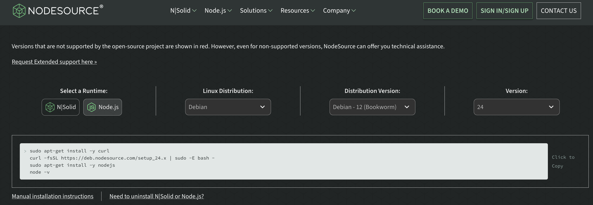

# Update Node

We tell how to update node for the Collections project. The node
versions don't last very long so you need to update them
frequently. The version that comes with Debian will be out-of-date in
18 months, way before Debian needs to be updated. Instead of using the
Debian node package you use the PPA repository for the version you
want. The Collection's Dockerfile installs node this way.

Collections uses node for three reasons, to handle the build process,
to handle image authentication and to handle push notifications.

We use the same node version on AWS to match the container's node
version. The container is used to test and build the code for AWS.

# Determine Version

Go to the nodesource website to determine the version you want to
update to.

* https://nodesource.com/products/distributions

There are dropdowns for the node details.

For collections select:

* runtime: node.js
* Linux Distribution: Debian
* Distribution Version: Debian 12
* version: 24

The page will show the following:

~~~
sudo apt-get install -y curl
curl -fsSL https://deb.nodesource.com/setup_24.x | sudo -E bash -
sudo apt-get install -y nodejs
node -v
~~~

[⬇](#Contents) Contents (table of contents at the bottom)

# Update Container

You install node when the docker container is built.  Update the
container's Dockerfile as shown below.  For the update from version 22
to 24 only one line needed to change:

~~~
env/debian/Dockerfile

- && curl -fsSL https://deb.nodesource.com/setup_22.x | bash - \
+ && curl -fsSL https://deb.nodesource.com/setup_24.x | bash - \
~~~

Build a new container using the runenv command. Exit the current
container, delete it, then build a new one:

~~~
# from container
exit
# from host
./runenv d
./runenv r
./runenv r
~~~

Rebuild the gulp build script and test it, then build the web code:

~~~
# from container
scripts/build-gulpfile
scripts/test-gulpfile
g all
~~~

[⬇](#Contents) Contents

# Details

The authenticate image requests document steps you through building
and testing image authentication and the notification document does
the same for push notifications.

* [Authenticate Image Requests](authenticate-image-requests.md) -— how image requests are authenticated on the server.
* [Notification](notification.md) -— how notifications and the red badge works.

For the authentication code you update the version number in
`env/lambda/auth-image-download/make-js-lambda-zip`, then test, deploy
and test again, following the steps in the authentication
documentation.

For notification you test the notification script and follow the steps in
the notification document.

# Contents

* [Determine Version](#determine-version) -– determine the version to update to and which update script to use.
* [Update Container](#update-container) -- how to install node in the container.
* [Details](#details) -- pointers to authencation and notification docs to test and deploy them.

