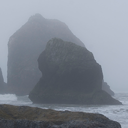

# Flenniken.net Collections

Collections is a progressive web app (PWA) for viewing curated
collections of photos.

A PWA runs in a browser but looks a lot like a native app.

Each collection is a small set of related photos, for example photos
of a trip to Many Glaciers Lodge.

You navigate and view images on three types of pages, the index page,
a thumbnails page, and an image page.

# Index Page

The index page shows the list of available collections with the most
recent collection on top.

There is a thumbnail for each collection and descriptive text.  The
text contains a title, description and post date.

You can scroll through the list and the most recent collections are
shown. When you reach the bottom of the list, there is a more
indicator.

Clicking on a collection switches to the thumbnails page.

# Thumbnails Page

The thumbnails page shows the collection’s thumbnails.

There are only a few images in a collection. This has benefits that
the users see the best photos and it puts more focus on the story
provided by the descriptions. It’s also easier to build well.

Past the bottom of the thumbnails you see the collection title and
description and an optional map showing the location of where the
photos were taken.

Scrolling down and holding goes back to the collection index Page.

Clicking on a thumbnail shows the full size photo on the image page.

# Image Page

The image page shows one image at a time.  The image is custom zoomed
(a zoom point) to fit the screen showing the best view for the screen
orientation and size.

You can zoom and pan an image.

You scroll up to see a description about the image.

You scroll left and right go to the previous and next images in the
collection. The next and previous images line up pixel perfect side by
side.  This is good for multi-images that look like one wide image.

You go back to the thumbnails page by scrolling down and holding.

# Run Collections

Since Collections is a PWA you can install the app on your iphone's
home screen then click on the app's icon to run it.

You can also run it from a URL in a browser but this is not
recommended. For the best experience run it from the installed
icon. You get a full screen experience and this is the tested path so
it works better.

You install the app’s icon on your home screen following these steps:

* launch safari on iphone (it doesn't install on chrome or firefox)
* go to:

https://flenniken.net/collections/index.html

* click on the share icon at the bottom center of the screen
* scroll up and select “Add to Home screen” and click add

Markdown image:

HTML image:

# Develop Collections

Collections is written in typescript and there is a build step.

You use the docker build environment to develop Collections. It has
all the programs installed needed to build the app.

The code folder is shared with the docker container and the host so
you can edit the files on the host and build them in the container.

# Setup

Make sure you have docker installed then run the following to fetch
the collections code and start the environment.

Get the code from github:

~~~
cd ~
mkdir -p code/collections
cd code/collections
git clone git@github.com:flenniken/collections.git .
~~~

Create and run the build environment. You run it twice, the first time
the r command creates the docker image, the second and following times
the r command runs it.

The prompt shows you're in the environment with "(debian)".

~~~
cd ~/code/collections
./runenv r
./runenv r

(debian)~/collections $
~~~

# Build

You build the app in the doctor container with the gulp app by typing
“g all”. The results go to the dist folder.

~~~
(debian)~/collections $ g all

[19:36:24] Using gulpfile ~/collections/gulpfile.js
[19:36:24] Starting 'all'...
[19:36:24] Starting 'ts'...
[19:36:24] Starting 'pages'...
[19:36:24] Starting 'css'...
[19:36:24] Starting 'i'...
[19:36:24] Starting 't'...
[19:36:24] Starting 'x'...
[19:36:24] Starting 'sw'...
[19:36:24] Starting 'index'...
[19:36:24] Starting 'thumbnails'...
[19:36:24] Starting 'image'...
[19:36:24] Compiling index template.
[19:36:24] Compiling thumbnails template.
[19:36:24] Compiling image template.
[19:36:24] Finished 'index' after 33 ms
[19:36:24] Finished 'thumbnails' after 33 ms
[19:36:24] Finished 'image' after 33 ms
[19:36:24] Finished 'pages' after 35 ms
[19:36:24] Compiling ./pages/collections.css - 949 B
[19:36:24] Copy collections.css - 765 B
[19:36:24] Compiling ./ts/index.ts - 664 B
[19:36:24] Compiling ./ts/thumbnails.ts - 800 B
[19:36:25] Compiling ./ts/sw.ts - 1.98 kB
[19:36:25] Compiling ./ts/image.ts - 26.31 kB
[19:36:26] Copy thumbnails.js - 841 B
[19:36:26] Copy sw.js - 2.88 kB
[19:36:26] Copy index.js - 689 B
[19:36:26] Finished 'css' after 2.02 s
[19:36:26] Copy image.js - 26.54 kB
[19:36:26] Finished 't' after 2.02 s
[19:36:26] Finished 'sw' after 2.02 s
[19:36:26] Finished 'x' after 2.02 s
[19:36:26] Finished 'i' after 2.03 s
[19:36:26] Finished 'ts' after 2.03 s
[19:36:26] Finished 'all' after 2.03 s
~~~

# Dist Folder

The dist folder contains the app files and nothing else.

~~~
(debian)~/collections $ tree dist

dist
|-- collections.css
|-- collections.webmanifest
|-- favicon.ico
|-- icons
|   |-- icon-128.png
|   |-- icon-168.png
|   |-- icon-192.png
|   |-- icon-256.png
|   ...
|-- images
|   |-- 1-p.jpg
|   |-- 1-t.jpg
|   |-- 2-p.jpg
|   |-- 2-t.jpg
|   ...
|-- index.html
|-- js
|   |-- image.js
|   |-- index.js
|   |-- shared.js
|   `-- thumbnails.js
|-- pages
|   |-- image-1.html
|   `-- thumbnails-1.html
`-- sw.js
~~~

# Gulp Tasks

You use gulp tasks in the container to compile the typescript to
javascript, to minimize it and to process the html templates.

Type g to see all the tasks:

~~~
(debian)~/collections $ g

[19:32:50] Using gulpfile ~/collections/gulpfile.js
[19:32:50] Starting 'default'...

gulp tasks:

Tasks:
* ts -- Compile and minimize ts files to dist/js.
    i -- Compile image.ts
    t -- Compile thumbnails.ts
    x -- Compile index.ts
    sw -- Compile sw.ts
* pages -- Create all the pages from templates.
    index -- Create the main index page.
    thumbnails -- Create the thumbnails page.
    image -- Create the image page.
* css -- Minimize the collection.css file.
* syncronize -- Syncronize the template's replace blocks with header.tea.
* run-server -- (alias gr) Run a test server exposing the dist folder on port
    8000. You can run it in the background with alias gr.
    Access files in your browser with: http://localhost:8000/index.html
* watch -- (alias gw) Watch file changes and call the appropriate task. You can
    run it in the background with alias gr.
* readme -- Show the readme file with glow.
* all -- Compile everything in parallel, tasks ts, pages and css.

[19:32:50] Finished 'default' after 1.98 ms
~~~

The g command is an alias.  You can type alias to see them.

~~~
(debian)~/collections $ alias

alias g='gulp'
alias gr='g run-server &'
alias gw='g watch &'
alias ll='ls -l'
alias ls='ls --color=auto'
alias sudo='sudo '
~~~

# Manual Test Procedures

When making changes to the image page test them with these steps:

* zoom at a point
* zoom to limits, small and big, then pan around
* zoom when v scrolled
* double click to restore
* h scroll
* h scroll half way
* h scroll at ends
* flick h scroll
* v scroll
* v scroll to the bottom then flick up
* zoom in then v scroll to 0 and hold
* click thumbnail to go to the same image page. make sure v scroll is at 100 and image is at zoom point
* v scroll and snap back
* long press to copy text
* debug with safari and iphone.  click Log Json to see json in the console.
* rotate landscape, h & v scroll
* no flash on load
* no flash on rotate
