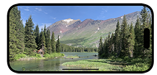

# Flenniken.net Collections

Collections is a progressive web app for viewing curated collections
of photos on an iphone.

It runs in a browser but looks a lot like a native app.

Each collection is a small set of related photos, for example photos
of a trip to Many Glaciers Lodge. Since there are only a few images in
a collection the user sees the best and more time can be spent on the
description’s story. It is also easier to build well.

You navigate and view images on three types of pages, the index page,
the thumbnails page, and the image page.

[⬇](#Contents) (table of contents at the bottom)

# Index Page

The index page shows the sorted list of available collections with the
most recent collection on top.

Each collection has a title, thumbnail, description, and post date.

You can scroll through the list. When you reach the bottom there is a
more indicator.

The icons do the following:

*  about the app
*  login and logout
*  view the collection's thumbnails
*  view the collection's images
*  download the collection's images
*  delete the collection's cached images

[⬇ ────────](#Contents)

# Thumbnails Page

The thumbnails page shows the collection’s thumbnails.

Past the bottom of the thumbnails you see the collection's title and
description which might be different description than on index page.

You go back to the index page by scrolling to the bottom and tapping
the index icon.

Tapping a camera icon shows the first photo full size on the image
page.  Tapping the index icon takes you to the index page.

[⬇ ────────](#Contents)

# Image Page

The image page shows one image at a time.  The image is custom zoomed
(a zoom point) to fit the screen showing the best view for the screen
orientation and size.

You can zoom and pan an image with two fingers and double tap to
restore it.

You scroll left and right to go to the previous and next images in the
collection. The next and previous images line up pixel perfect side by
side.  This is good for multi-images that look like one wide image.

You scroll to the bottom to see a description of the image.

You go back to the thumbnails or index page by scrolling to the bottom
and tapping the thumbnail or index icon.

[⬇ ────────](#Contents)

# Run Collections

Since Collections is a PWA you can install the app's icon on your
iphone's home screen then tap it to run.

You can also run it from a URL in a browser but this is not
recommended. For the best experience run it from the installed
icon. You get a full screen experience and this is the tested path so
it works better.

You install the app’s icon on your home screen following these steps:

* launch safari on iphone (it doesn't install on chrome or firefox)
* go to:

https://collections.flenniken.net

* tap the share icon at the bottom center of the screen
* scroll down and select “Add to Home screen” and tap add

[⬇ ────────](#Contents)

# Build Collections

Collections is written in typescript and there is a build step.

You use the provided docker build environment to develop
Collections. It has all the programs installed needed to build the
app.

The code folder is shared with docker and your local environment so
you can edit files locally and build them in the container.

[⬇ ────────](#Contents)

# Build Setup

You setup for building Collections with these steps:

* download the code
* install docker
* create docker container

You download the code with the following commands. They create a
collections folder in your code home folder then pull the code from
github.

~~~
cd ~
mkdir -p code/collections
cd code/collections
git clone git@github.com:flenniken/collections.git .
~~~

You install docker, if not already installed,  from the docker website:

* https://docs.docker.com/get-docker/

You create the build environment by running the runenv command as
shown below. You run runenv’s r command twice, the first time the r
command creates the docker image, the second and following times the r
command runs the docker container. The command prompt shows you're in
the build environment in the collections folder.

~~~
cd ~/code/collections
./runenv r
./runenv r

(debian)~/collections $
~~~

The environment has a few aliases defined for common commands:

~~~
(debian)~/collections $ alias

alias g='gulp'
alias gr='g run-server &'
alias gw='g watch &'
alias ll='ls -l'
alias ls='ls --color=auto'
alias sudo='sudo '
~~~

You stop the environment by typing ctrl-d.

[⬇ ────────](#Contents)

# Build All

You build the app in the doctor container with the gulp app by typing
“g all”. The results go to the dist folder. Here is an example:

~~~
(debian)~/collections $ g all

[01:35:42] Using gulpfile ~/collections/gulpfile.js
[01:35:42] Starting 'all'...
[01:35:42] Starting 'pages-folder'...
[01:35:42] Finished 'pages-folder' after 16 ms
[01:35:42] Starting 'ts'...
[01:35:42] Starting 'pages'...
[01:35:42] Starting 'css'...
[01:35:42] Starting 'vpages'...
[01:35:42] Starting 'i'...
[01:35:42] Starting 't'...
[01:35:42] Starting 'sw'...
[01:35:42] Starting 'index'...
[01:35:42] Starting 'thumbnails'...
[01:35:42] Starting 'image'...
[01:35:42] Starting 'vindex'...
[01:35:42] Starting 'vthumbnails'...
[01:35:42] Starting 'vimage'...
...
[01:35:44] Finished 't' after 2.18 s
[01:35:44] Finished 'sw' after 2.18 s
[01:35:44] Finished 'x' after 2.18 s
[01:35:44] Finished 'i' after 2.18 s
[01:35:44] Finished 'ts' after 2.18 s
[01:35:44] Finished 'all' after 2.2 s
~~~

[⬇ ────────](#Contents)

# Build Tasks

You use gulp tasks in the container to compile the typescript to
javascript, to minimize it and to process the html templates.

Type g to see all the tasks:

~~~
(debian)~/collections $ g

[23:47:42] Using gulpfile ~/collections/gulpfile.js
[23:47:42] Starting 'default'...

Tasks:
* ts -- Compile and minimize ts files to dist/js.
    i -- Compile image.ts
    t -- Compile thumbnails.ts
    x -- Compile index.ts
    sw -- Compile sw.ts
* pages -- Create all the pages from templates.
    index -- Create the main index page.
    thumbnails -- Create the thumbnails page.
    image -- Create the image page.
* vpages -- Validate all the html files.
    vindex -- Validate index html
    vthumbnails -- Validate thumbnails html
    vimage -- Validate image html
* css -- Minimize the collection.css file.
* syncronize -- Syncronize the template's replace blocks with header.tea.
* run-server -- (alias gr) Run a test server exposing the dist folder on port
    8000. You can run it in the background with alias gr.
    Access files in your browser with: http://localhost:8000/index.html
* watch -- (alias gw) Watch file changes and call the appropriate task. You can
    run it in the background with alias gw.
* readme -- Show the readme file with glow.
* all -- Compile everything in parallel, tasks ts, pages and css.

[23:47:42] Finished 'default' after 1.64 ms
~~~

[⬇ ────────](#Contents)

# Build Folder

The dist folder contains the app files and nothing else.  The static
resources are checked in to this folder. The compiled resources are
put here.

~~~
(debian)~/collections $ tree dist

dist
|-- collections.css
|-- collections.webmanifest
|-- favicon.ico
|-- icons
|   |-- icon-128.png
|   |-- icon-168.png
|   |-- icon-192.png
|   |-- icon-256.png
|   ...
|-- images
|   |-- 1-p.jpg
|   |-- 1-t.jpg
|   |-- 2-p.jpg
|   |-- 2-t.jpg
|   ...
|-- index.html
|-- js
|   |-- image.js
|   |-- index.js
|   `-- thumbnails.js
|-- pages
|   |-- image-1.html
|   `-- thumbnails-1.html
`-- sw.js
~~~

[⬇ ────────](#Contents)

# Login Setup

Collections uses the AWS Cognito service to handle login.  This allows
collections to be a public static website without a backend server
(other than AWS).

Users login with an email an password. You add and remove users
manually.

Admin users see debugging controls in the UI.

You run two scripts, cognito and login-flow, for working with
cognito.

## Cognito Script

You use the cognito script to create and maintain the AWS Cognito user
pool.

~~~
# docker container
scripts/cognito
~~~

The cognito script communicates with AWS Cognito through an IAM user
with the correct permissions.

## Create IAM User

You need to create an IAM user with the correct permissions.  To do
this you login to your AWS account console and select the IAM
service. Click the plus sign to add a new user and give it cognito
power user permissions, and SES readonly permissions
(AmazonCognitoPowerUser, AmazonSESReadOnlyAccess).  Save the
credentials somewhere safe. You need the credentials when you create
a new docker image.

Put the credentials on the docker container with the aws command line
as shown below.

~~~
# from docker container
aws configure 
~~~

## Create Pool

You create a new user pool with cognito as shown below. In the
example we name the pool “collections-pool”.

~~~
# from docker container
scripts/cognito —c collections-pool
~~~

## Create Config File

The config file is used by the website and the login-flow script so
they know how to communicate with the AWS Cognito user pool.

You create the config file with cognito as shown below. It reads the
pool information from AWS.

~~~
# docker container
scripts/cognito —w collections-pool
~~~

## Login-flow Script

You use login-flow script to manually step through and debug and test
the website login process and decode tokens.

~~~
# docker container
scripts/login-flow

This script is for testing the login flow that Collections uses.

The basic flow:

  * Use -l to get the login url.
  * Paste the login url in your browser and login, you will be redirected.
  * Copy the code in the url in your browser's address bar.
  * Use -g option specifying the code. This creates the tokens.json file.
  * Use -s to look at the tokens file.
  * Use -d id_token, -d access_token, -d refresh_token, to peer into each token.
~~~

[⬇ ────────](#Contents)

# Test Tips

How to develop on Chrome, Safari or xcode simulator.

For Chrome you start a local server on the dist folder (gr) and work
in a phone view. You enable the mouse to simulate touch, see Test
Touch. You set up at least two phone views for a “iPhone 14 Pro Max”,
portrait 430 x 933 and landscape 932 x 430.

For Safari you plug your iphone into your mac and debug remotely, see
Test on iphone.

For xcode simulator, you get it by installing xcode.  Launch it and
run an iphone 14 max. Like chrome you run the code on a localhost
server (gr) and reference a localhost url. You can test the install
process and two finger touching. It’s also good for making screenshots
that include the bezel. You can see the console log in desktop safari
like you do when debugging a plugged in iphone.

[⬇ ────────](#Contents)

# Test Touch

You can test one finger touch with your mouse in Chrome on your
desktop by turning on a setting in the developers tools.

* bring up tools, right click and select inspect
* bring up the run command: menu (three dots) > Run command
* type “sensors” in the Run box and type enter -- the sensors tab appears
* scroll down to the touch section and select "Force Enabled"
* test by mousing over the web page.  The mouse cursor should be a small circle.

[⬇ ────────](#Contents)

# Test on iphone

You can use safari on your mac to debug collections on an iphone
connected with a wire.  Safari works as if the app was on your mac.

You must have a new iphone os and matching mac os version. The os and
safari have the same version number and are bundled together, so look
at the mac version number to compare.

To debug:

* connect iphone with wire
* launch collections on iphone by tapping the collections desktop icon
* launch Safari on your mac
* pull down the develop menu and select collections

[⬇ ────────](#Contents)

# Test Procedure

When making changes to the image page test them with these steps:

* zoom at a point
* zoom to limits, small and big, then pan around
* zoom when v scrolled
* double tap to restore
* h scroll
* h scroll half way and snap back
* flick h scroll
* h scroll and overscroll on both ends
* v scroll and overscroll on both ends
* zoom image small, go to thumbnails, tap the same image and verify image is at its zoom point
* long press to copy text then extend the selection
* rotate the last image then rotate it back and verify it remains on the same image
* scroll h & v in landscape mode
* no flash on load and no flash on rotate
* tap the thumbnails menu icon
* tap the index menu icon

# Contents

* [Index Page](#index-page)
* [Thumbnails Page](#thumbnails-page)
* [Image Page](#image-page)
* [Run Collections](#run-collections)
* [Build Collections](#build-collections)
* [Build Setup](#build-setup)
* [Build All](#build-all)
* [Build Tasks](#build-tasks)
* [Build Folder](#build-folder)
* [Login Setup](#login-setup)
* [Test Tips](#test-tips)
* [Test Touch](#test-touch)
* [Test on iphone](#test-on-iphone)
* [Test Procedure](#test-procedure)
