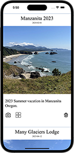
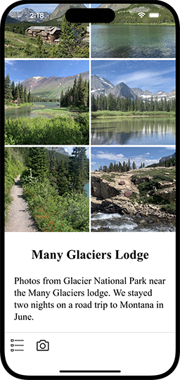

# Flenniken.net Collections

You use Collections to privately share your photos with your friends
and family on an iphone.  It runs in a browser but looks a lot like a
native app.

Each collection contains photos related to a single topic, place, or
event, with a description about each one. Having associated text and
good photos is intended to make the collection more meaningful and
long lasting.

You navigate and view collections on three types of pages, the index
page, the thumbnails page, and the image page.

[⬇](#Contents) (table of contents at the bottom)

# Index Page

The index page shows the sorted list of available collections with the
most recent collection on top.

Each collection has a title, thumbnail, description, and post date.

You can scroll through the list. When you reach the bottom there is a
more indicator.

You login with your email and password by clicking the circle icon in
the upper righthand side of the index page. You see your first initial
when logged in, otherwise you see a person. When you are logged in and
you click the icon, you see your name and the logout button.

You must be logged in to download and view new collections. You can
continue to view already downloaded collections when not logged in.

The icons do the following:

*  about the app
*  login and logout
*  view the collection's thumbnails
*  view the collection's images
*  download the collection's images
*  delete the collection's cached images

[⬇ ────────](#Contents)

# Thumbnails Page

The thumbnails page shows the collection’s thumbnails.

Past the bottom of the thumbnails you see the collection's title and
description which might be different description than on index page.

You go back to the index page by scrolling to the bottom and tapping
the index icon.

Tapping a camera icon shows the first photo full size on the image
page.  Tapping the index icon takes you to the index page.

[⬇ ────────](#Contents)

# Image Page

The image page shows one image at a time.  The image is custom zoomed
(a zoom point) to fit the screen showing the best view for the screen
orientation and size.

You can zoom and pan an image with two fingers and double tap to
restore it.

You scroll left and right to go to the previous and next images in the
collection. The next and previous images line up pixel perfect side by
side.  This is good for multi-images that look like one wide image.

You scroll to the bottom to see a description of the image.

You go back to the thumbnails or index page by scrolling to the bottom
and tapping the thumbnail or index icon.

[⬇ ────────](#Contents)

# Run Collections

Since Collections is a PWA you can install the app's icon on your
iphone's home screen then tap it to run.

You can also run it from a URL in a browser but this is not
recommended. For the best experience run it from the installed
icon. You get a full screen experience and this is the tested path so
it works better.

You install the app’s icon on your home screen following these steps:

* launch safari on iphone (it doesn't install on chrome or firefox)
* go to:

https://collections.sflennik.com

* tap the share icon at the bottom center of the screen
* scroll down and select “Add to Home screen” and tap add

# Contents

* [Index Page](#index-page)
* [Thumbnails Page](#thumbnails-page)
* [Image Page](#image-page)
* [Run Collections](#run-collections)

# Other

* [Developer Topics](docs/developer.md) &mdash; how to build and develop Collections.
